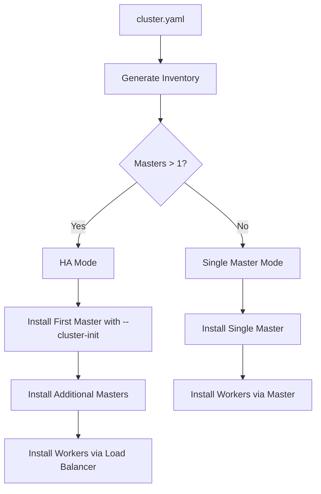

# Multi-Master k3s Setup - Zero Configuration HA

## Overview

ZTC now supports **automatic multi-master k3s setup** without requiring manual Ansible configuration. Simply add more master nodes to your `cluster.yaml` and ZTC handles all the complexity automatically.

## Key Features

✅ **Zero Ansible Editing** - No manual inventory or role modifications  
✅ **Automatic HA Detection** - Detects multiple masters and configures HA mode  
✅ **Intelligent Validation** - Warns about configuration issues before deployment  
✅ **Load Balancer Support** - Built-in support for kube-vip, HAProxy, nginx  
✅ **Embedded etcd** - Automatic embedded etcd cluster for HA  
✅ **Backward Compatible** - Single master setups continue to work unchanged  

## Quick Start: 2 Master + 6 Worker Setup

### 1. Configure cluster.yaml

```yaml
cluster:
  name: "ztc-production"
  description: "Production HA cluster"
  version: "1.0.0"
  ha_config:
    enabled: true
    virtual_ip: "192.168.50.30"  # Optional but recommended
    load_balancer:
      type: "kube-vip"
      port: 6443

nodes:
  ssh:
    key_path: "~/.ssh/id_ed25519.pub"
    username: "ubuntu"
  cluster_nodes:
    k3s-master-01:
      ip: "192.168.50.10"
      role: "master"  # First master
    k3s-master-02:
      ip: "192.168.50.11"
      role: "master"  # Second master - triggers HA mode
    k3s-worker-01:
      ip: "192.168.50.12"
      role: "worker"
    k3s-worker-02:
      ip: "192.168.50.13"
      role: "worker"
    k3s-worker-03:
      ip: "192.168.50.14"
      role: "worker"
    k3s-worker-04:
      ip: "192.168.50.15"
      role: "worker"
    k3s-worker-05:
      ip: "192.168.50.16"
      role: "worker"
    k3s-worker-06:
      ip: "192.168.50.17"
      role: "worker"
```

### 2. Deploy with Standard Commands

```bash
# Standard ZTC workflow - no changes needed!
make prepare
make setup

# ZTC automatically detects HA configuration and:
# - Creates embedded etcd cluster
# - Configures first master with --cluster-init
# - Joins second master to cluster
# - Configures workers to use virtual IP
# - Sets up load balancer for API access
```

### 3. Verify HA Cluster

```bash
# Check cluster status
make status

# Verify both masters are ready
kubectl get nodes -l node-role.kubernetes.io/control-plane=true

# Test failover - stop one master, cluster should remain operational
ssh k3s-master-01 'sudo systemctl stop k3s'
kubectl get nodes  # Should still work via master-02
```

## How It Works

### Automatic Detection

When ZTC processes your `cluster.yaml`:

1. **Counts master nodes** - If > 1, enables HA mode automatically
2. **Generates HA inventory** - Creates specialized Ansible groups:
   - `k3s_master_first` - First master (cluster initialization)
   - `k3s_master_additional` - Additional masters (join cluster)
   - `k3s_master:children` - Combined group for all masters
3. **Sets HA variables** - Configures load balancer, virtual IP, etcd settings
4. **Validates configuration** - Checks for conflicts and best practices

### Deployment Flow



### k3s HA Configuration

**First Master:**
```bash
INSTALL_K3S_EXEC="--cluster-init --flannel-backend=vxlan ..."
K3S_TOKEN=<secure-token>
```

**Additional Masters:**
```bash
INSTALL_K3S_EXEC="--flannel-backend=vxlan ..."
K3S_URL=https://<first-master>:6443
K3S_TOKEN=<secure-token>
```

**Workers:**
```bash
INSTALL_K3S_EXEC="--flannel-backend=vxlan ..."
K3S_URL=https://<virtual-ip>:6443  # Or first master if no VIP
K3S_TOKEN=<secure-token>
```

## Configuration Options

### HA Configuration Block

```yaml
cluster:
  ha_config:
    enabled: true                    # Auto-detected if multiple masters
    virtual_ip: "192.168.50.30"      # Optional virtual IP for load balancing
    load_balancer:
      type: "kube-vip"              # kube-vip, haproxy, nginx, external
      port: 6443                    # API server port
    etcd_config:
      snapshot_count: 10000         # etcd snapshot frequency
      heartbeat_interval: "100ms"   # etcd heartbeat interval
```

### Load Balancer Types

| Type | Description | Use Case |
|------|-------------|----------|
| `kube-vip` | In-cluster VIP management | **Recommended** - Simple, cloud-native |
| `haproxy` | External HAProxy instance | External load balancer required |
| `nginx` | External nginx proxy | HTTP/HTTPS termination needed |
| `external` | User-managed load balancer | Custom infrastructure |

### Storage Recommendations

For multi-master clusters, **Longhorn is recommended** over NFS:

```yaml
storage:
  strategy: "longhorn"
  default_class: "longhorn"
  longhorn:
    enabled: true
    replica_count: 3  # Distribute across workers
```

## Best Practices

### Master Count Guidelines

| Masters | Use Case | Pros | Cons |
|---------|----------|------|------|
| **1** | Development, testing | Simple, resource efficient | No HA |
| **2** | Minimum HA | Better than single master | No quorum advantage |
| **3** | **Recommended production** | Proper quorum, fault tolerant | Balanced resources |
| **5** | Large production | Higher availability | More complex |

### Network Planning

```yaml
# Example network layout for HA cluster
network:
  subnet: "192.168.50.0/24"
  
# Node allocation:
# 192.168.50.10 - k3s-master-01
# 192.168.50.11 - k3s-master-02  
# 192.168.50.12-17 - workers
# 192.168.50.20 - storage
# 192.168.50.30 - virtual IP (VIP)
```

### Resource Requirements

**Minimum per node type:**
```yaml
# Masters (embedded etcd + API server)
cpu: "2"
memory: "4Gi"

# Workers (application workloads)  
cpu: "4"
memory: "8Gi"

# Storage (NFS/Longhorn)
cpu: "2" 
memory: "4Gi"
storage: "500Gi"
```

## Validation and Troubleshooting

### Pre-deployment Validation

```bash
# Validate HA configuration
./scripts/lib/validate-ha-config.sh validate cluster.yaml

# Get HA improvement suggestions
./scripts/lib/validate-ha-config.sh suggest cluster.yaml
```

### Common Issues

**Issue: Even number of masters warning**
```
⚠️ Warning: Even number of masters (2) detected
   Consider using odd number (3, 5, 7) for proper etcd quorum
```
*Solution: Add a third master for proper etcd quorum, or accept 2-master setup for cost savings.*

**Issue: Virtual IP conflicts with node IP**
```
❌ Virtual IP conflicts with node k3s-master-01: 192.168.50.10
```
*Solution: Choose a VIP outside the node range, e.g., 192.168.50.30*

**Issue: Masters not forming cluster**
```bash
# Check first master logs
kubectl logs -n kube-system -l component=kube-apiserver

# Check etcd cluster members
kubectl get nodes -l node-role.kubernetes.io/control-plane=true
```

### Health Checks

```bash
# Verify all masters are ready
kubectl get nodes -l node-role.kubernetes.io/control-plane=true

# Check etcd cluster health
kubectl get endpoints kube-scheduler -n kube-system -o yaml

# Test API server via VIP
curl -k https://192.168.50.30:6443/healthz
```

## Migration from Single Master

### Existing Single Master → HA

1. **Add new master nodes** to cluster.yaml
2. **Add HA configuration** block
3. **Update inventory**: `make update-inventory`
4. **Deploy additional masters**: `make setup`

### Configuration Example

```yaml
# Before (single master)
cluster_nodes:
  k3s-master:
    ip: "192.168.50.10"
    role: "master"

# After (HA setup)
cluster_nodes:
  k3s-master-01:
    ip: "192.168.50.10"  # Existing master
    role: "master"
  k3s-master-02:
    ip: "192.168.50.11"  # New master
    role: "master"
  k3s-master-03:         # Optional third master
    ip: "192.168.50.12"
    role: "master"
```

## Advanced Features

### External Load Balancer Integration

```yaml
cluster:
  ha_config:
    load_balancer:
      type: "external"
      port: 6443
    # Configure your external LB to point to:
    # - 192.168.50.10:6443 (master-01)  
    # - 192.168.50.11:6443 (master-02)
```

### Custom etcd Configuration

```yaml
cluster:
  ha_config:
    etcd_config:
      snapshot_count: 5000          # More frequent snapshots
      heartbeat_interval: "50ms"    # Faster heartbeat for low-latency networks
```

### Security Considerations

- **TLS certificates**: k3s automatically handles certificate generation and distribution
- **Token security**: ZTC generates secure cluster tokens via Sealed Secrets
- **Network isolation**: Consider separate VLANs for cluster traffic
- **Backup strategy**: Regular etcd snapshots via Longhorn or external backup

## Summary

ZTC's multi-master support provides:

🎯 **Zero-touch HA** - Add masters to cluster.yaml, ZTC handles everything else  
🔒 **Production-ready** - Embedded etcd, load balancing, proper certificates  
⚡ **Streamlined UX** - No Ansible editing, complex configuration, or manual steps  
🔧 **Flexible** - Support for various load balancer types and custom configurations  
📊 **Validated** - Built-in checks for best practices and configuration issues  

The same simple `make setup` command that works for single-master clusters now seamlessly handles complex multi-master HA deployments.